# Enigma Medallion Data Pipeline

Este projeto implementa um pipeline de engenharia de dados baseado na arquitetura Medallion (Bronze, Silver e Gold), estruturado de forma desacoplada e modular em Python para simular cenários reais de DataOps e processamento em streaming.

O pipeline é projetado para lidar com dados de streaming que chegam fora de ordem e com mensagens duplicadas de rede, realizando ordenação temporal com o campo `part_index` e deduplicação cronológica idempotente.

## 📐 Arquitetura do Pipeline

```mermaid
flowchart TD
    classDef prod fill:#e0f2fe,stroke:#0284c7,stroke-width:2px,color:#0f172a;
    classDef cons fill:#f3e8ff,stroke:#7e22ce,stroke-width:2px,color:#0f172a;
    classDef bronze fill:#ffedd5,stroke:#c2410c,stroke-width:2px,color:#0f172a;
    classDef silver fill:#f8fafc,stroke:#475569,stroke-width:2px,color:#0f172a;
    classDef gold fill:#fef9c3,stroke:#a16207,stroke-width:2px,color:#0f172a;
    classDef api fill:#ecfdf5,stroke:#047857,stroke-width:2px,color:#0f172a;

    subgraph PIPELINE DE DADOS
        A["1. PRODUCER<br>(Streaming em tempo real)<br><b>Apache Kafka</b>"] --> B["2. CONSUMER<br>(Consumo de tópicos)<br><b>Python (Consumer)</b>"]
        B --> C["3. BRONZE (Dados Brutos)<br>(Ingestão sem alterações)<br><b>Amazon S3 / Lake</b>"]
        C --> D["4. SILVER (Dados Tratados)<br>(Limpeza, ordenação e deduplicação)<br><b>Spark / PySpark</b>"]
        D --> E["5. GOLD (Dados Interpretados)<br>(Geração do resultado e regras)<br><b>Python / Spark</b>"]
        E --> F["6. API REST Final<br>(Envio do resultado via HTTP)<br><b>POST HTTP Request</b>"]
    end

    class A prod;
    class B cons;
    class C bronze;
    class D silver;
    class E gold;
    class F api;
```



## 📂 Estrutura do Projeto

*   `consumer/`: Ingestão do stream de dados e validação de schemas básicos.
*   `bronze/`: Landing zone crua que grava os arquivos originais com metadados.
*   `silver/`: Processamento, higienização, deduplicação e ordenação de índices.
*   `gold/`: Reconstituição inteligente da mensagem final e auditoria de qualidade.
*   `api/`: API REST e Dashboard de monitoramento em tempo real com FastAPI.
*   `tests/`: Suíte de testes automatizados com Pytest.

## 🚀 Como Executar

### 1. Ativar o Ambiente Virtual
```powershell
.\.venv\Scripts\Activate.ps1
```

### 2. Executar a Simulação do Pipeline
```powershell
python run_pipeline.py
```

### 3. Executar os Testes Unitários
```powershell
pytest -v
```

### 4. Rodar o Servidor de API e o Dashboard
```powershell
python -m uvicorn api.app:app --reload
```
Acesse o painel interativo em: `http://127.0.0.1:8000`
